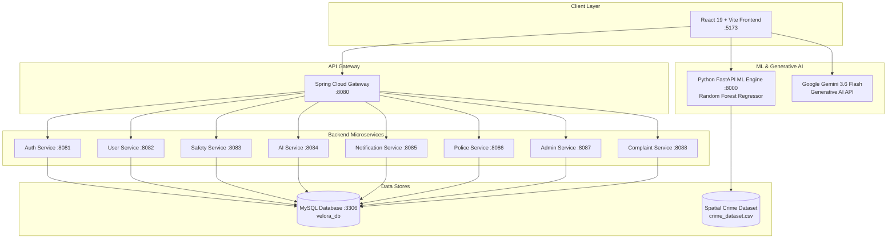

<div align="center">

# 🛡️ VELORA — AI-Powered Women Safety Platform

**Predictive Safety Analytics • Safe Route Navigation • 1-Tap SOS Dispatch • Real-time Police Intelligence**

[](https://react.dev/)
[](https://spring.io/projects/spring-boot)
[](https://fastapi.tiangolo.com/)
[](https://ai.google.dev/)
[](https://www.mysql.com/)

[Key Features](#-key-features) • [System Architecture](#-system-architecture) • [Microservices & Ports](#-microservices--port-mapping) • [Quick Start](#-quick-start) • [API Overview](#-api-endpoints)

---

</div>

## 📖 Overview

**Velora** is an enterprise-grade, community-driven Women's Safety & Emergency Intelligence Platform. It fundamentally transforms personal safety from **reactive** *(waiting for an emergency to unfold)* to **proactive** *(evaluating risk factors ahead of time, identifying high-risk corridors, recommending well-lit routes, and deploying early preventive alerts)*.

Built on a decoupled microservices architecture with a high-performance **React 19** frontend, **Java Spring Boot** microservices, a **Python FastAPI / RandomForest** ML risk engine, and **Google Gemini 3.6 Flash** generative intelligence connected directly to the live platform database.

---

## 🌟 Key Features

### 1. 🤖 Predictive ML Area Safety Scoring
- Evaluates real-time **Safety Scores (0–100)** for geographic coordinates using a trained `RandomForestRegressor` (150 trees, max depth 12, **98.92% R² accuracy**) and historical spatial datasets (2,500 records).
- Analyzes multi-dimensional risk vectors:
  - **Street Lighting Density (%)**
  - **Police Proximity & Patrol Frequency (%)**
  - **CCTV Camera Surveillance Coverage (%)**
  - **Pedestrian Crowd Density (%)**
  - **Emergency Response Unit Speed (%)**
- Renders dynamic **Hexagonal SVG Area Safety Radars** and categorized crime breakdown bars.

### 2. 🗺️ Safe Route Recommendation & Navigation
- Recommends travel routes evaluated on illumination levels, safe zone density, and police patrol routes rather than merely shortest distance.
- Integrated with Google Maps JavaScript API for live path rendering and risk waypoints.

### 3. 🚨 1-Tap SOS Emergency Dispatch
- **3-Second SOS Trigger:** Automated dispatch capturing user GPS coordinates, battery level, and victim profile.
- **Instant Dual Alerts:** Broadcasts live tracking links via SMS to designated primary emergency contacts while simultaneously transmitting priority distress alerts to the **Police Control Room (100 / 112)**.

### 4. 📝 Community Incident & Evidence Reporting
- Citizens can file incident reports (Harassment, Stalking, Unlit Street, Suspicious Activity, Assault) with multimedia evidence upload.
- Full case lifecycle management: `Reported` ➔ `Under Review` ➔ `Under Investigation` ➔ `Resolved`.

### 5. 🏠 Verified Safe Zones Directory & Geofencing
- Real-time directory and map visualizer of 24/7 verified safe houses, police refuge kiosks, and emergency medical hubs with contact info and safety scores.

### 6. 💬 Native Gemini AI Safety & Database Assistant
- Powered by **Google Gemini 3.6 Flash** free AI engine embedded natively inside the dashboard.
- Directly connected to live microservice databases to perform real-time data analysis:
  - *"Analyze all incident reports from the database"*
  - *"How many verified safe zones are registered?"*
  - *"Are there active SOS alerts right now?"*
  - *"Evaluate the safety score for my current location"*
- Instant emergency protocol override prioritizes **112 / 100 / 1091** guidance whenever distress keywords are detected.
- Includes speech-to-text voice dictation, text-to-speech audio playback, and chat export (TXT/JSON).

### 7. 👮 Police Command Center & Admin Portal
- Dedicated operational dashboards for law enforcement officers:
  - Active SOS alerts monitoring with live victim GPS coordinates.
  - Case assignment, unit dispatch, and investigation logs.
  - Administrative tools for managing safe zones, system health audits, and city-wide risk telemetry.

---

## 🏗️ System Architecture



---

## 📡 Microservices & Port Mapping

| Service Name | Technology | Port | Primary Responsibilities |
| :--- | :--- | :--- | :--- |
| **velora-frontend** | React 19, Vite, Axios | `5173` | User, Police & Admin Portals, Live Radar, AI Chatbot |
| **velora-ml-service** | Python 3.11, FastAPI, Scikit-learn | `8000` | ML Risk Scoring, Crime Category Analysis, Spatial Features |
| **velora-api-gateway** | Spring Cloud Gateway | `8080` | Unified API routing, JWT validation, CORS management |
| **velora-auth-service** | Spring Boot, Spring Security | `8081` | User registration, JWT issuance, OTP verification |
| **velora-user-service** | Spring Boot, Spring Data JPA | `8082` | User profiles, emergency contacts configuration |
| **velora-safety-service** | Spring Boot, MySQL | `8083` | Safe zone directory, risk geofences, route histories |
| **velora-ai-service** | Spring Boot, WebClient | `8084` | AI safety advice, fallback routing engines |
| **velora-notification-service** | Spring Boot, JavaMail | `8085` | SMS dispatch, push notifications, email alerts |
| **velora-police-service** | Spring Boot, MySQL | `8086` | Real-time SOS alerts, patrol unit dispatch, officer roster |
| **velora-admin-service** | Spring Boot, MySQL | `8087` | Platform health monitoring, admin safe zone management |
| **velora-complient-service** | Spring Boot, Multipart IO | `8088` | Incident logging, photo evidence uploads, case tracking |

---

## 🚀 Quick Start

### Prerequisites
- **Node.js** v18+ & **npm**
- **Python** 3.10+ (with virtual environment)
- **Java** 17+ & **Maven**
- **MySQL** 8.0 running on `localhost:3306` (database: `velora_db`)

---

### 1. Start the Machine Learning Microservice (FastAPI)

```powershell
# Navigate to the ML service
cd velora-ml-service

# Activate Python virtual environment
..\.venv\Scripts\Activate.ps1

# Start the FastAPI engine
uvicorn app.main:app --host 0.0.0.0 --port 8000 --reload
```
- **ML API Base:** `http://localhost:8000`
- **Interactive Swagger Docs:** `http://localhost:8000/docs`

---

### 2. Start the Frontend Application (React + Vite)

Open a new terminal:

```powershell
# Navigate to frontend
cd velora-frontend

# Install dependencies (if not already installed)
npm install

# Start development server
npm run dev
```
- **Frontend URL:** `http://localhost:5173`
- **AI Safety Page:** `http://localhost:5173/ai-analysis`

---

### 3. Start Backend Microservices (Spring Boot)

Each service in `velora-backend/` can be launched via Maven or your IDE:

```bash
# Example: Starting API Gateway
cd velora-backend/velora-api-gateway
./mvnw spring-boot:run

# Example: Starting Complaint Service
cd velora-backend/velora-complient-service
./mvnw spring-boot:run
```

---

## 🔑 Environment Configuration

Create a `.env` file in `velora-frontend/` (pre-configured):

```env
VITE_GOOGLE_MAPS_API_KEY=your_google_maps_api_key
VITE_API_BASE_URL=http://localhost:8080/api/v1
VITE_ML_SERVICE_URL=http://localhost:8000
VITE_GEMINI_API_KEY=your_gemini_api_key
```

---

## 🧪 Testing & Validation

```powershell
# Run production frontend build
cd velora-frontend
npm run build

# Run ML Service imports check
python -c "import app.main; print('ML service verified successfully')"
```

---

## 🛡️ Emergency Numbers (India)

| Authority | Hotline Number |
| :--- | :--- |
| **National Emergency Support (ERSS)** | `112` |
| **Police Control Room** | `100` |
| **Women in Distress Helpline** | `1091` |
| **National Cyber Crime Reporting** | `1930` |
| **Ambulance Services** | `108 / 102` |

---

## 📄 License

This project is licensed under the [MIT License](LICENSE).
Velora is developed to empower women and citizens with intelligent, proactive personal safety technology.
